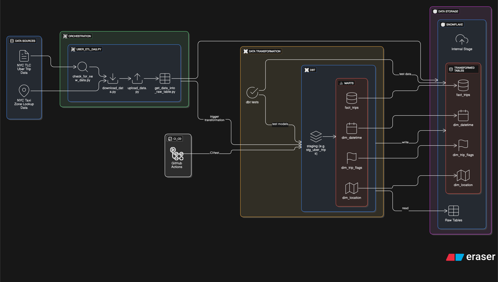
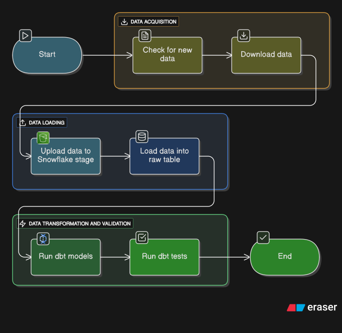

# Uber ETL Pipeline

This project implements a robust and automated ETL (Extract, Transform, Load) pipeline for analyzing Uber trip data. It leverages modern data stack tools like Apache Airflow for orchestration, dbt (data build tool) for data transformation, and Snowflake as the data warehouse. The pipeline is designed for efficient, incremental processing and includes CI/CD practices to ensure data quality and reliability.

## Features

-   **Automated Data Ingestion**: The pipeline automatically checks for and downloads the latest monthly Uber trip data in Parquet format, along with NYC taxi zone lookup data, directly from the NYC TLC website.
-   **Efficient Data Loading**: Data is efficiently uploaded to a Snowflake internal stage. The system intelligently checks for existing files to prevent redundant uploads and ensures data integrity.
-   **Incremental Data Transformation with dbt**: Utilizes dbt to incrementally transform and model raw data into a structured, analytics-ready format. This approach processes only new or modified data, significantly optimizing performance and resource usage.
-   **Orchestration with Apache Airflow**: A dedicated Airflow DAG (`uber_etl_dag.py`) orchestrates the entire ETL process, from initial data download and staging to dbt model building and comprehensive data quality testing.
-   **Robust CI/CD Automation**: A GitHub Actions workflow automates the testing and validation of the dbt project. It employs a "slim CI" strategy to test only modified models and their dependencies, accelerating feedback loops.
-   **Comprehensive Data Quality Testing**: Integrates dbt tests to enforce data integrity, uniqueness, non-null constraints, and freshness, ensuring the highest quality of transformed data.

## Architecture Diagram




## Project Structure

```
uber_etl_pipeline/
├── .github/                      # GitHub Actions CI/CD workflows
│   └── workflows/
│       └── ci.yml                # CI pipeline for dbt project
├── dags/                         # Apache Airflow DAGs
│   └── uber_etl_dag.py           # Main ETL orchestration DAG
├── dbt/                          # dbt project for data transformation
│   ├── models/                   # dbt models (staging, marts)
│   │   ├── marts/
│   │   │   ├── bi/               # Business intelligence models
│   │   │   └── core/             # Core fact and dimension models
│   │   └── staging/              # Staging models from raw data
│   ├── seeds/                    # Seed data (e.g., lookup tables)
│   └── tests/                    # dbt data quality tests
├── include/                      # Python scripts for Airflow tasks
│   ├── check_for_new_data.py
│   ├── download_data.py
│   ├── get_data_into_raw_table.py
│   └── upload_data.py
├── .astro/                       # Astro CLI configuration for Airflow
├── Dockerfile                    # Docker configuration for environment
├── packages.txt                  # OS-level dependencies for Docker
├── requirements.txt              # Python dependencies
└── README.md                     # Project overview and documentation
```

## Getting Started

### Prerequisites

Ensure you have the following installed and configured:

-   **dbt Core**: Follow the [dbt installation guide](https://docs.getdbt.com/docs/installation).
-   **Docker**: Required for running the Airflow environment locally via Astro CLI. [Get Docker](https://docs.docker.com/get-docker/).
-   **Astro CLI**: For local Airflow development and orchestration. [Install Astro CLI](https://docs.astronomer.io/astro/cli/install-cli).
-   **Snowflake Account**: Access to a Snowflake data warehouse is essential.
-   **Python 3.x**: Recommended version 3.9 or higher.

### Setup

1.  **Clone the repository:**

    ```bash
    git clone https://github.com/LukaJikhvashvili/Uber-Trips-ETL-Pipeline-and-Analysis.git
    cd Uber-Trips-ETL-Pipeline-and-Analysis
    ```

2.  **Install Python dependencies:**

    ```bash
    pip install -r requirements.txt
    ```

3.  **Install dbt project dependencies:**

    Navigate to the `dbt` directory and install necessary packages:

    ```bash
    cd dbt
    dbt deps
    cd ..
    ```

4.  **Configure Snowflake credentials and environment variables:**

    Create a `.env` file in the project root with your Snowflake connection details and other configurations. Refer to the `requirements.txt` for specific variable names.

    ```bash
    SNOWFLAKE_ACCOUNT=your_snowflake_account_identifier
    SNOWFLAKE_USER=your_snowflake_username
    SNOWFLAKE_PASSWORD=your_snowflake_password
    SNOWFLAKE_ROLE=your_snowflake_role
    SNOWFLAKE_WAREHOUSE=your_snowflake_warehouse
    SNOWFLAKE_DATABASE=your_snowflake_database
    SNOWFLAKE_SCHEMA=your_raw_data_schema # e.g., RAW
    SNOWFLAKE_STAGE=your_internal_stage_name # e.g., UBER_TRIPS_STAGE
    SNOWFLAKE_FILE_FORMAT=your_parquet_file_format # e.g., PARQUET_FILE_FORMAT
    DATA_YEAR_RANGE=2022-2024 # The range of years for which to download data (e.g., 2022-2024)
    ```
    *(Ensure these variables match your Snowflake setup and the dbt `profiles.yml` configuration.)*

### Running the Pipeline with Airflow (Local)

The ETL pipeline is orchestrated by the `uber_etl_dag` Airflow DAG. To run it locally using the Astro CLI:



1.  **Start the Airflow environment:**

    From the root of your project, execute:

    ```bash
    astro dev start
    ```
    This command builds Docker images and starts Airflow components (scheduler, webserver, worker, PostgreSQL, Redis).

2.  **Access the Airflow UI:**

    Open your web browser and navigate to `http://localhost:8080`. Log in with `admin:admin`.

3.  **Unpause and Trigger the DAG:**

    In the Airflow UI, locate the `uber_etl_dag`. Toggle it "On" (unpause) and then manually trigger it to start the ETL process.

## Data Models (dbt)

The dbt project transforms raw Uber trip data into a structured, query-optimized format. Key models include:

-   **`stg_uber_trips`**: Staging model that cleans, standardizes, and performs initial transformations on the raw Uber trip data ingested from Snowflake's internal stage.
-   **`fact_trips`**: An incremental fact table containing granular trip details. This model is designed to efficiently add new trip records over time.
-   **`dim_datetime`**: A conformed dimension table providing comprehensive date and time attributes, enabling flexible time-based analysis.
-   **`dim_location`**: A dimension table for detailed location information, including taxi zones, allowing for geographical analysis of trips.
-   **`dim_trip_flags`**: A dimension table encapsulating various flags and attributes related to trip characteristics or payment types, facilitating deeper analytical segmentation.


## CI/CD Pipeline (GitHub Actions)

The project includes a robust CI/CD pipeline defined in `.github/workflows/ci.yml`. This workflow automates the testing and validation of the dbt project whenever changes are pushed to the `main` branch or a pull request is opened.

**Slim CI Approach**: The pipeline utilizes a "slim CI" methodology. Instead of rebuilding and testing the entire dbt project on every change, it intelligently identifies only the dbt models that have been modified (or their upstream/downstream dependencies) compared to the `main` branch. This significantly reduces CI run times, provides faster feedback to developers, and optimizes resource consumption.

## Metabase Dashboards


## Data Sources

The ETL pipeline processes data from the following public sources:

-   **Uber Trip Data**: Monthly Parquet files containing high-volume for-hire vehicle (HVFHV) trip records provided by the NYC Taxi & Limousine Commission (TLC). Data is sourced from the [TLC Trip Record Data](https://www.nyc.gov/site/tlc/about/tlc-trip-record-data.page) website.
-   **Taxi Zone Lookup Data**: A supplementary CSV file providing a lookup table for NYC taxi zones, also available from the [TLC Trip Record Data](https://www.nyc.gov/site/tlc/about/tlc-trip-record-data.page) website. This data is used to enrich location-based analysis.

## Future Enhancements

-   Implement data quality alerts and notifications.
-   Explore integration with a data visualization tool (e.g., Tableau, Power BI) for direct reporting.
-   Expand dbt models to include more complex analytics (e.g., surge pricing analysis, driver efficiency).
-   Migrate to a more robust secrets management solution for production deployments.
